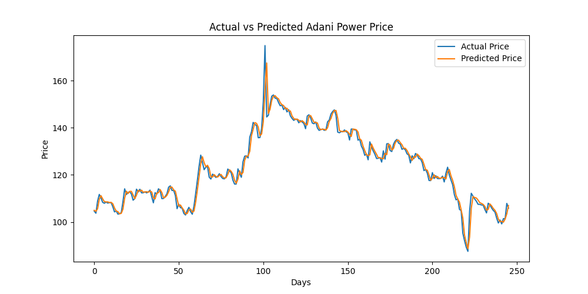

# Adani Power Stock Price Prediction

A full-stack machine learning project that predicts Adani Power's next-day closing price using historical stock data, with a Flask API backend and React frontend. we can change the stock also if we want to see some other stock price and all!.

## Problem Statement
Predict the next day's closing price of Adani Power stock using recent price trends and momentum indicators.

## Tech Stack
- **ML/Data:** Python, pandas, scikit-learn, yfinance
- **Backend:** Flask, Flask-CORS
- **Frontend:** React
- **Model Persistence:** Pickle

## Approach
1. Pulled 5 years of historical daily stock data using `yfinance`
2. Engineered features: previous day's close, 5-day moving average, 10-day moving average, and daily % change
3. Split data chronologically (no shuffling) to avoid data leakage — trained on earlier years, tested on later years
4. Trained and compared two models:
   - Linear Regression
   - Random Forest Regressor
5. Evaluated using MSE and R²

## Results
| Model | MSE | R² |
|-------|-----|-----|
| Linear Regression | 7.84 | 0.966 |
| Random Forest | 488.08 | -1.098 |

**Linear Regression significantly outperformed Random Forest.** This is because Random Forest cannot extrapolate beyond the price ranges it saw during training — since Adani Power's price grew substantially between the training and testing periods, Random Forest's predictions were capped near its training range, while Linear Regression could extrapolate along the trend.



## Architecture

## How to Run
### Backend
```bash
cd flask_app
pip install -r requirements.txt
python flask1.py
```
### Frontend
```bash
cd frontend
npm install
npm start
```

## Future Improvements
- Add news sentiment analysis as a feature
- Extend to intraday (minute-level) predictions
- Add more stocks for comparison

